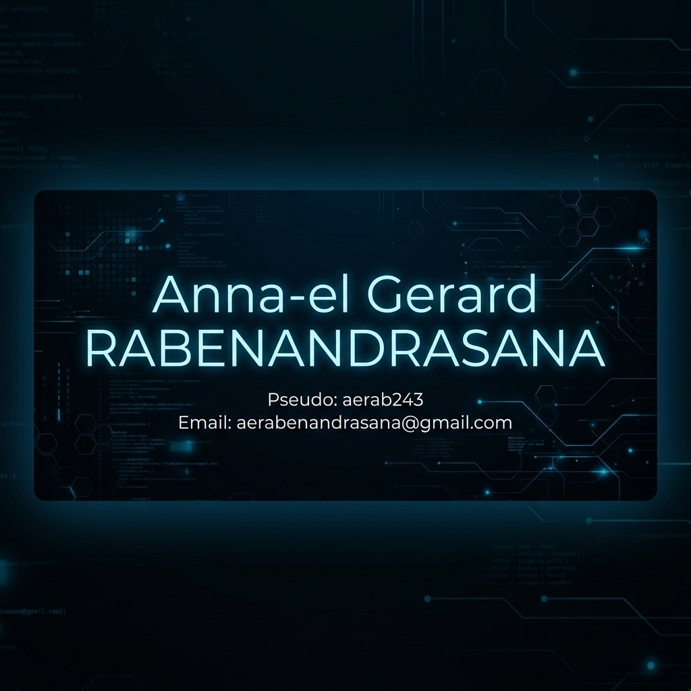

<div align="center">
  
</div>

<h1 align="center">
  
</h1>

<p align="center">
  
  
  
  
</p>

<div align="center">
  <a href="#-about"></a>
  <a href="#-expertise"></a>
  <a href="#-achievements"></a>
  <a href="#-tech-stack"></a>
  <a href="#-projects"></a>
  <a href="#-connect"></a>
</div>

---

## Core Pillars

<table align="center" width="100%">
  <tr>
    <td align="center" width="25%">
      
      <br><sub><b>Designing scalable systems</b></sub>
    </td>
    <td align="center" width="25%">
      
      <br><sub><b>Leading high-performing teams</b></sub>
    </td>
    <td align="center" width="25%">
      
      <br><sub><b>Aligning tech with business</b></sub>
    </td>
    <td align="center" width="25%">
      
      <br><sub><b>Driving digital transformation</b></sub>
    </td>
  </tr>
</table>

---

## About Me

<details open>
<summary><b>Who am I?</b></summary>
<br>

**Anna-el Gerard RABENANDRASANA**

> *"Bridging the gap between complex technical architectures and strategic business value."*

I am a **results-driven IT Manager & Business Analyst** with a passion for transforming organizations through technology. My expertise spans:

- **Enterprise Architecture** - Designing robust, scalable systems that support business growth
- **Team Leadership** - Managing and mentoring 10+ engineers through complex projects
- **Business Strategy** - Translating stakeholder vision into actionable technical roadmaps
- **Cloud-Native Solutions** - Building serverless, containerized architectures on AWS/Azure
- **Digital Transformation** - Leading organizational change through process optimization

**My Mission:** Transform complex business challenges into elegant, scalable technical solutions that drive measurable impact.

</details>

---

## Current Learning Journey

<table width="100%">
  <tr>
    <td width="50%">
      <h4>Cloud Mastery</h4>
      <ul>
        <li>AWS Solutions Architect certification track</li>
        <li>Serverless architecture patterns</li>
        <li>Multi-cloud strategy & optimization</li>
      </ul>
    </td>
    <td width="50%">
      <h4>Infrastructure Excellence</h4>
      <ul>
        <li>Terraform & Infrastructure as Code</li>
        <li>Kubernetes orchestration & GitOps</li>
        <li>Automated deployment pipelines</li>
      </ul>
    </td>
  </tr>
  <tr>
    <td width="50%">
      <h4>Data-Driven Leadership</h4>
      <ul>
        <li>Advanced analytics & BI tools</li>
        <li>Data-driven decision making</li>
        <li>Business intelligence platforms</li>
      </ul>
    </td>
    <td width="50%">
      <h4>Agile at Scale</h4>
      <ul>
        <li>SAFe (Scaled Agile Framework)</li>
        <li>Enterprise agile transformation</li>
        <li>Cross-functional team coordination</li>
      </ul>
    </td>
  </tr>
</table>

---

## Key Achievements

<table width="100%">
  <tr>
    <td width="50%" valign="top">
      <details>
        <summary><b>35% Business Efficiency Gain</b></summary>
        <blockquote style="border-left: 4px solid #00D1FF; padding-left: 15px; margin: 10px 0;">
          Optimized mission-critical workflows through automated data validation and streamlined handoffs. Reduced processing time by 35%, saving 1000+ hours annually.
        </blockquote>
      </details>
    </td>
    <td width="50%" valign="top">
      <details>
        <summary><b>Led 10+ Engineers Successfully</b></summary>
        <blockquote style="border-left: 4px solid #00D1FF; padding-left: 15px; margin: 10px 0;">
          Managed cross-functional team delivering multi-layered Information System on schedule. Fostered continuous integration culture and shared technical ownership.
        </blockquote>
      </details>
    </td>
  </tr>
  <tr>
    <td width="50%" valign="top">
      <details>
        <summary><b>3 Digital Transformation Projects</b></summary>
        <blockquote style="border-left: 4px solid #00D1FF; padding-left: 15px; margin: 10px 0;">
          Translated C-suite vision into technical backlogs for 3 major transformation initiatives. Bridged communication gaps between executives and engineering teams.
        </blockquote>
      </details>
    </td>
    <td width="50%" valign="top">
      <details>
        <summary><b>Cloud Migration Success</b></summary>
        <blockquote style="border-left: 4px solid #00D1FF; padding-left: 15px; margin: 10px 0;">
          Led enterprise migration to cloud-native architecture, reducing infrastructure costs by 40% and improving system reliability to 99.9% uptime.
        </blockquote>
      </details>
    </td>
  </tr>
</table>

---

## Expertise Matrix

### Management & Leadership

<table width="100%">
  <tr>
    <td width="50%">
      <b>Team Leadership</b><br>
      
    </td>
    <td width="50%">
      <b>Project Management</b><br>
      
    </td>
  </tr>
  <tr>
    <td width="50%">
      <b>Process Optimization</b><br>
      
    </td>
    <td width="50%">
      <b>Strategic Planning</b><br>
      
    </td>
  </tr>
</table>

### Technical Architecture

<table width="100%">
  <tr>
    <td width="50%">
      <b>Software Architecture</b><br>
      
    </td>
    <td width="50%">
      <b>Cloud Architecture</b><br>
      
    </td>
  </tr>
  <tr>
    <td width="50%">
      <b>DevOps & Infrastructure</b><br>
      
    </td>
    <td width="50%">
      <b>Data Analytics</b><br>
      
    </td>
  </tr>
</table>

---

## Tech Stack & Tools

### Strategy & Methodologies

<div align="center">
  
  
  
  
  
</div>

### Programming Languages

<div align="center">
  
  
  
  
  
</div>

### Cloud & Infrastructure

<div align="center">
  
  
  
  
  
</div>

### DevOps & Tools

<div align="center">
  
  
  
  
  
</div>

### Data & Analytics

<div align="center">
  
  
  
  
  
</div>

### Project Management

<div align="center">
  
  
  
  
</div>

---

## GitHub Analytics

<div align="center">
  
</div>

<div align="center">
  
</div>

<div align="center">
  
</div>

---

## Languages

<div align="center">
  
  
  
</div>

---

## Collaborations & Opportunities

<table width="100%">
  <tr>
    <td width="50%" align="center">
      <h3>Open to Opportunities</h3>
      <ul align="left">
        <li>Enterprise Architecture roles</li>
        <li>Cloud Solutions leadership</li>
        <li>Technical Team Lead positions</li>
        <li>Digital Transformation initiatives</li>
        <li>Strategic Consulting projects</li>
      </ul>
    </td>
    <td width="50%" align="center">
      <h3>Collaboration Interests</h3>
      <ul align="left">
        <li>Open Source contributions</li>
        <li>Technical Mentoring & coaching</li>
        <li>Knowledge Sharing & workshops</li>
        <li>Strategic Partnerships</li>
        <li>Community Building initiatives</li>
      </ul>
    </td>
  </tr>
</table>

---

## Connect With Me

<div align="center">
  <a href="mailto:aerabenandrasana@gmail.com">
    
  </a>
  <a href="https://linkedin.com/in/aerab243">
    
  </a>
  <a href="https://github.com/aerab243">
    
  </a>
  <a href="https://twitter.com/aerab243">
    
  </a>
</div>

---

## Development Environment

<details>
<summary><b>My Setup</b></summary>
<br>

```
OS          .  Arch Linux
Shell       .  zsh + tmux + OhMyZsh
Editor      .  Neovim (LunarVim/NvChad)
Terminal    .  Kitty + Powerlevel10k
Theme       .  Dracula / Tokyo Night
Font        .  JetBrains Mono Nerd Font
```

</details>

---

## About This Profile

<div align="center">
  <details>
  <summary><b>The Human Behind the Code</b></summary>
  <br>
  <p>
    Coffee Powered . Customizer . Music Enthusiast<br>
    Fitness Advocate . Lifelong Learner . Global Thinker
  </p>
  <p>
    <sub>Built with passion and extreme dedication to technology & innovation</sub>
  </p>
  </details>
</div>

---

<div align="center">
  
  <br>
  <sub>Last updated: 2026-04-12</sub>
</div>

